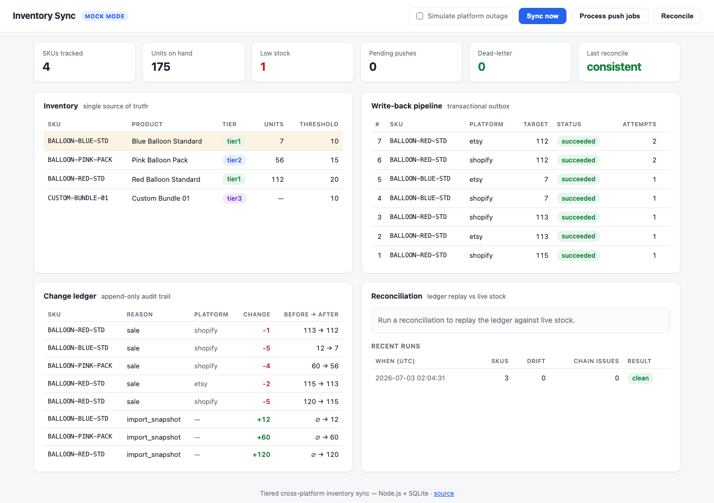
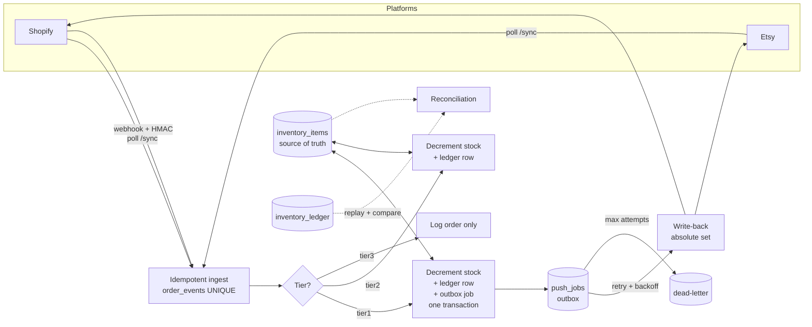

# Tiered Cross-Platform Inventory Sync System

[](https://github.com/ZhiqiaoGong/inventory-sync-system/actions/workflows/ci.yml)

A prototype inventory system that keeps a single, normalized internal stock table in sync across
multiple sales channels (Shopify and Etsy). Built with Node.js, Express, and SQLite.





The decision log behind this shape — why tiers, why one-way data flow, why an outbox instead of a
broker, why oversell clamps to zero — lives in [docs/DESIGN.md](docs/DESIGN.md).

## The core idea: tiered sync, not all-or-nothing

Most "sync everything automatically" systems break on the messy 20% of SKUs (bundles, kits,
pack-vs-unit mismatches). This system treats sync as a spectrum instead:

| Tier  | Meaning                    | Behavior on a sale                                                         |
| ----- | -------------------------- | -------------------------------------------------------------------------- |
| tier1 | Standardized SKU           | Decrement central stock, then write the new quantity back to the platforms |
| tier2 | Trackable, not auto-synced | Decrement central stock only; never push to platforms                      |
| tier3 | Complex SKU                | Log the order; keep a manual workflow (no reliable unit-level stock)       |

The internal table is the single source of truth; platforms are downstream. This lets a small team
roll out automation gradually instead of betting the whole catalog on day one.

## Reliability engineering

The prototype-sized stack (Node.js + SQLite) deliberately implements production-grade delivery
semantics:

- **Exactly-once order processing.** Order ingestion is idempotent by `(platform, event id)`, with
  the UNIQUE constraint as the arbiter for the check-then-insert race. A multi-process test drives
  4 concurrent worker processes through the same 60 orders against one database and asserts that
  stock is decremented exactly once per order — no double-counts, no lost updates.
- **Transactional outbox for write-backs.** A tier1 sale enqueues its platform push in the same
  SQLite transaction that decrements stock, so "stock changed" and "write-back owed" can never
  diverge. Pushes are absolute-set, so pending jobs coalesce to the latest value per SKU+platform.
- **Retry with exponential backoff + dead-letter queue.** Failed pushes retry on a
  `base * 2^attempt` schedule (configurable); after `PUSH_MAX_ATTEMPTS` they land in a dead-letter
  queue (`GET /push-jobs/dead-letter`) for a human, who can requeue them once the platform
  recovers. Every attempt is recorded in `sync_push_logs`.
- **Ledger reconciliation.** Every stock change (imports included) appends a before/after row to
  `inventory_ledger`. Reconciliation replays the chain per SKU and cross-checks it against live
  stock two ways: chain integrity (`before + change == after`, gapless links) and drift (final
  ledger value vs. the inventory table). Out-of-band edits surface with the exact delta.
- **Signed webhook ingestion.** `POST /webhooks/shopify` verifies `X-Shopify-Hmac-Sha256` over the
  raw body with a timing-safe comparison; replayed deliveries are deduplicated by the same
  idempotent event store, so a replay can never double-count stock.

## Quick start (no credentials needed)

The project ships in `mock` mode by default, so it runs end to end with built-in sample orders and
never calls a real API. You do not need Shopify or Etsy access to see it work.

```bash
npm install
npm run demo
```

`npm run demo` initializes a throwaway database, imports the sample inventory, runs a simulated
Shopify + Etsy sync, and prints the full result: the resolved orders, the updated stock, the change
ledger, and the platform write-back logs. It exercises every tier branch (including an unmatched
SKU), then simulates a platform outage to walk the retry → dead-letter → requeue pipeline, and
finishes by letting reconciliation catch a stock edit that bypassed the ledger.

To run it as a live server (still mock mode):

```bash
cp .env.example .env
npm run init-db
npm run import-csv -- ./sample_inventory.csv
npm start            # then open http://localhost:3000
```

With the server running, `npm run send-mock-webhook` demonstrates the signed webhook
path: a valid delivery is processed, an exact replay is deduplicated, and a wrong signature is
rejected with 401.

## Dashboard

`npm start` also serves a zero-build dashboard (plain HTML/CSS/JS) at
[http://localhost:3000](http://localhost:3000): the inventory table with tier chips and low-stock
highlighting, the write-back pipeline with per-job attempt counts and one-click dead-letter
requeue, the append-only change ledger, and a reconciliation runner. In mock mode a
**Simulate platform outage** switch makes every write-back fail with a synthetic 503, so you can
watch a sale's push retry, dead-letter, and — after switching the outage off and requeueing —
deliver the latest coalesced value. **Reset demo** wipes everything back to the sample inventory.

### Hosting the demo

The repo ships a [render.yaml](render.yaml) blueprint: on [Render](https://render.com), choose
**New → Blueprint**, point it at this repository, and the mock-mode demo deploys on the free plan
with no further configuration. The demo needs no credentials, seeds itself with the sample
inventory on boot (`SEED_SAMPLE_ON_START`), and visitors can always return it to a clean state
with the dashboard's Reset button.

## Benchmarks

`npm run bench` runs a reproducible local benchmark against a throwaway database (mock platforms,
no network). On an Apple M2 (8 cores, Node 24):

| Scenario                                                  | Result                                    |
| --------------------------------------------------------- | ----------------------------------------- |
| Order ingestion, single process (2,000 orders / 200 SKUs) | ~4,800 orders/sec · p95 0.21 ms per order |
| Full tier1 sale incl. outbox + write-back to 2 platforms  | ~2,200 sales/sec end-to-end               |
| 4 processes racing the same 2,000 orders on one database  | ~4,100 unique orders/sec, exactly-once ✓  |

The contention scenario re-verifies the exactly-once invariant at the end of the run: every order
processed by exactly one worker, stock decremented exactly once per order, ledger chain unbroken.

## HTTP API

| Method | Path                     | Description                                         |
| ------ | ------------------------ | --------------------------------------------------- |
| GET    | `/health`                | Health check                                        |
| GET    | `/inventory`             | Current inventory snapshot                          |
| GET    | `/inventory/low-stock`   | Items at or below their low-stock threshold         |
| POST   | `/sync/shopify`          | Pull and process Shopify orders                     |
| POST   | `/sync/etsy`             | Pull and process Etsy receipts                      |
| POST   | `/sync/all`              | Pull and process both platforms                     |
| POST   | `/webhooks/shopify`      | Signed (HMAC-SHA256) order webhook, replay-safe     |
| POST   | `/push-jobs/process`     | Deliver due write-back jobs (cron-friendly)         |
| GET    | `/push-jobs/dead-letter` | Write-backs that exhausted retries                  |
| POST   | `/push-jobs/:id/requeue` | Give a dead-lettered job a fresh set of attempts    |
| POST   | `/reconcile`             | Replay the ledger and report drift/chain violations |
| GET    | `/reconciliations`       | Recent reconciliation runs (audit trail)            |

## Architecture

```
src/
  db.js          SQLite schema + prepared statements
  platforms.js   Shopify/Etsy API wrappers (mock or live, with failure injection)
  mockData.js    Sample orders used in mock mode
  services.js    Business logic: tiering, ledger, outbox/retry, reconciliation
  webhooks.js    HMAC-SHA256 webhook signature verification
  csv.js         Minimal CSV parser
  app.js         Express app (exported for tests)
  server.js      Entry point: app + listen
public/          Zero-build dashboard (vanilla HTML/CSS/JS)
docs/DESIGN.md   Decision log: the why behind each design choice
scripts/
  initDb.js      Create tables
  importInventoryCsv.js  Load the internal inventory table from CSV
  syncOrdersOnce.js      One-shot order sync (for cron)
  processPushJobs.js     One-shot push-job dispatcher (for cron)
  reconcile.js           One-shot reconciliation; non-zero exit on drift
  sendMockWebhook.js     Signed webhook demo: valid / replayed / forged
  demo.js        End-to-end demo (npm run demo)
  benchmark.js   Reproducible throughput/latency benchmark (npm run bench)
test/
  tiering.test.js        Tier1/2/3 + unresolved + oversell behavior
  idempotency.test.js    Replaying an order does not double-count
  pushRetry.test.js      Outbox: backoff, coalescing, dead-letter, requeue
  reconciliation.test.js Drift + chain-violation detection
  concurrency.test.js    4 processes, same orders, exactly-once (multi-process)
  webhook.test.js        HMAC verification + replay protection over HTTP
```

Data model highlights:

- `inventory_items` / `sku_mappings` map each platform SKU to one `internal_sku`.
- `order_events` deduplicates incoming orders (idempotent by platform + external id).
- `inventory_ledger` records every stock change with before/after values for auditability.
- `push_jobs` is the transactional outbox for platform write-backs (pending / succeeded /
  skipped / dead_letter, with attempt counts and backoff schedule).
- `sync_push_logs` records each write-back attempt (success / failed / skipped) with a reason.
- `reconciliation_runs` keeps an audit trail of every reconciliation and its findings.

## Testing

```bash
npm test            # unit tests (Node's built-in test runner)
npm run format:check # Prettier formatting check
```

Tests run against isolated temporary SQLite databases and cover the core business rules and the
reliability guarantees: each tier's behavior on a sale, unmatched-SKU handling, oversell clamping,
order idempotency, retry/backoff/dead-letter mechanics, reconciliation (drift and chain
violations), webhook signature verification over real HTTP, and a multi-process exactly-once test
(4 workers racing over the same orders). CI runs the tests, the formatting check, and the
end-to-end demo on Node 20 and 22.

## Going live

Set `PLATFORM_MODE=live` in `.env` and fill in the Shopify/Etsy credentials. Two things to know:

- Shopify write-back uses the absolute-set inventory endpoint and is ready to go once credentials
  and the inventory-item / location mappings are present.
- Etsy inventory payloads depend on each listing's variant structure. The pull side and the call
  entry point are in place, but `productsPayload` in `services.js` is a placeholder you complete
  against one of your real listings before enabling Etsy write-back.

## Known boundaries

This is a runnable prototype, not a full ERP. Stock decrements are safe across processes on one
machine (IMMEDIATE SQLite transactions + busy_timeout, verified by the concurrency test), but the
following are not included yet: OAuth token refresh, bundle/kit expansion, a built-in scheduler
(the one-shot scripts are designed for cron), automatic construction of the Etsy inventory
payload, and multi-machine deployments (SQLite is single-host by nature). These are natural next
steps.
